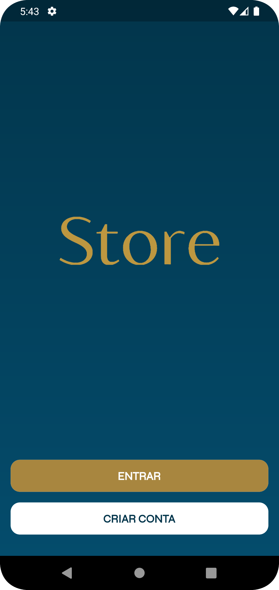
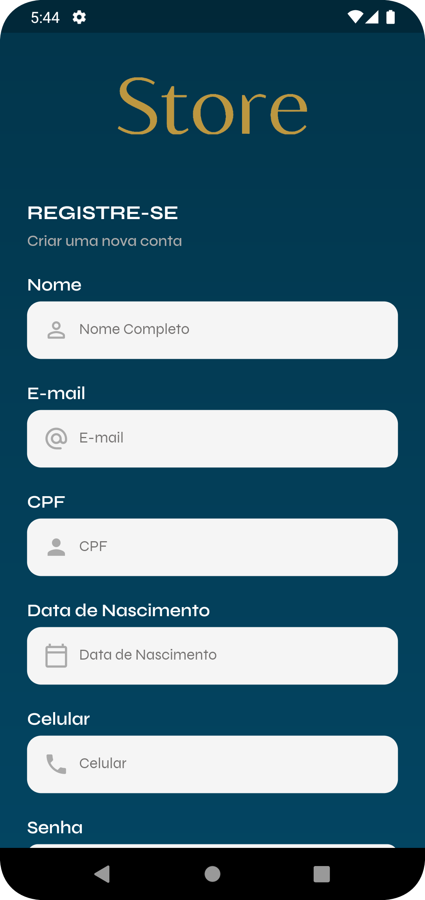
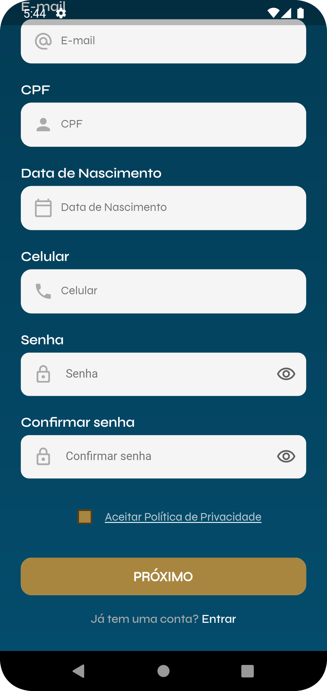
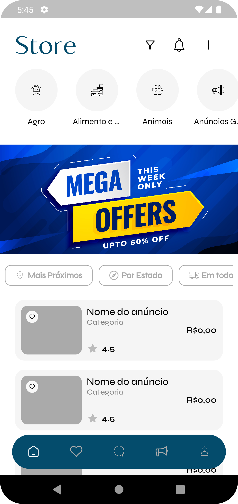
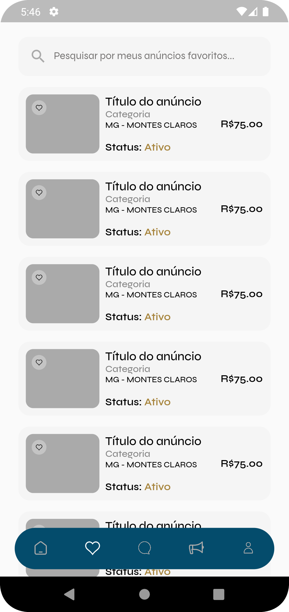
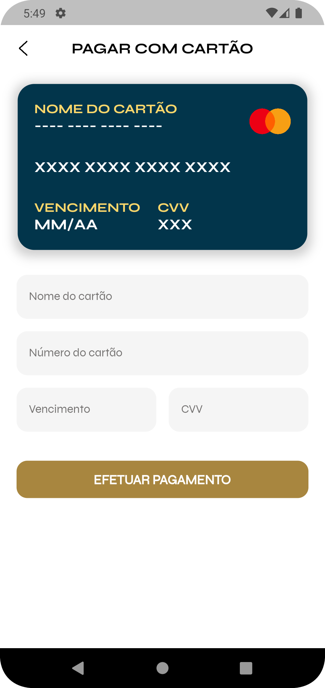
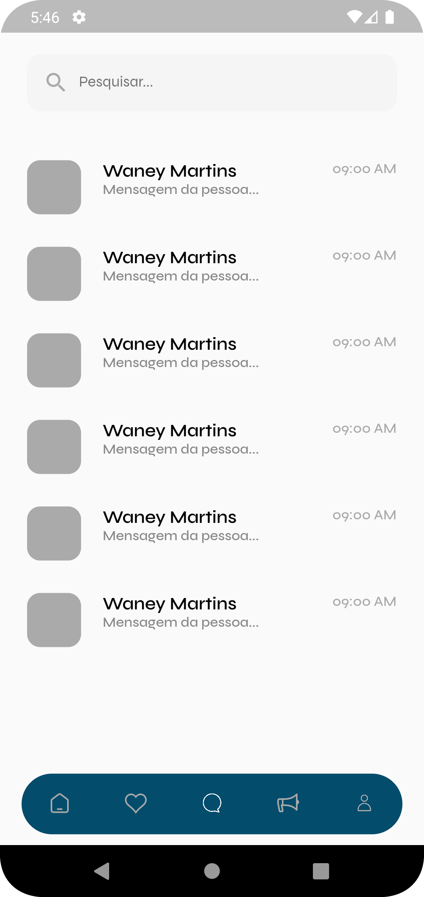
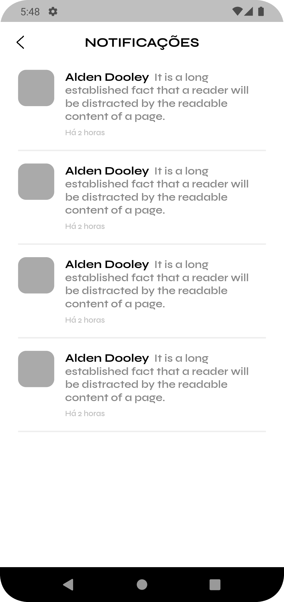
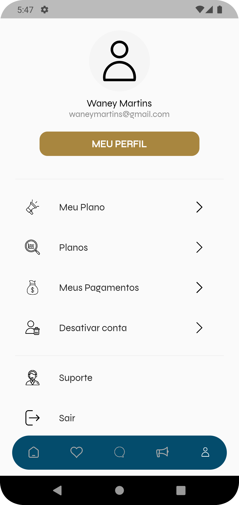

## Store - Aplicativo de Anúncios

Aplicativo desenvolvido em Flutter que oferece uma plataforma de anúncios responsiva, ideal para uso em lojas, gerenciamento de anúncios e muito mais. Inspirado em aplicativos populares como OLX, esse aplicativo possui um layout moderno e intuitivo, oferecendo uma experiência de usuário fluida e agradável.

## Download

- [Clique aqui para baixar o vídeo com todos os detalhes](https://github.com/waneymartinsM/store_oficial/blob/master/assets/video.mp4)

## Demonstração

